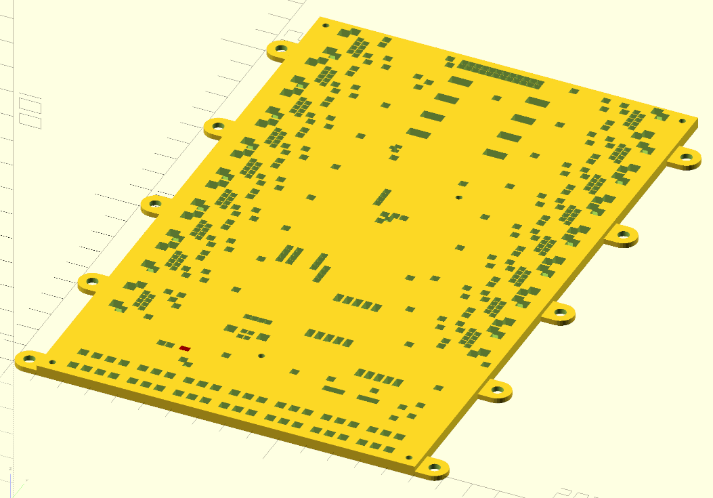

# kicad2scad

Create PCB holder from a PCB. Basically we generate cubes around THT parts and cylinders at mounting holes, subtract it from a surface and then the PCB can be laid onto it. Contrary to supporting only at mounting holes, the PCB is supported on the whole area.



## Usage:

```
./box.py board.kicad_pcb > diff.scad
```
When stdout is a tty, it shows a plot of the board.

In OpenSCAD:
```
%union() {include <diff.scad>}
```

Presumably you want a difference from a big cube/other surface, see `example.scad`.
